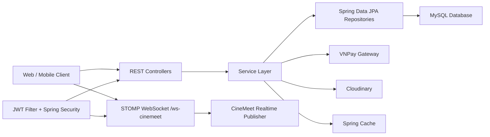
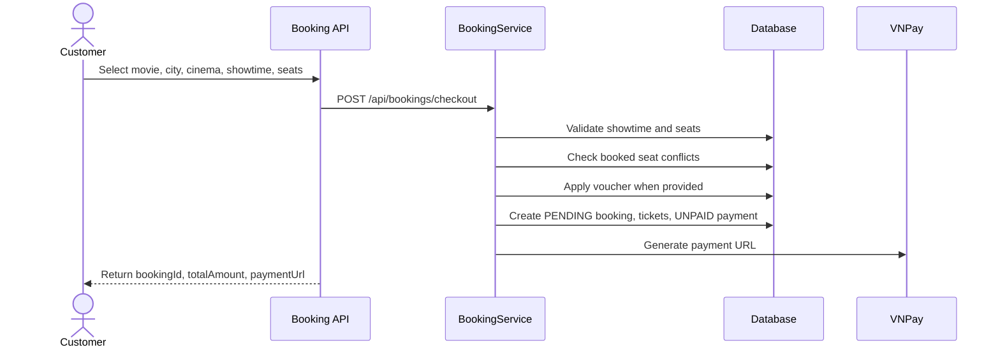
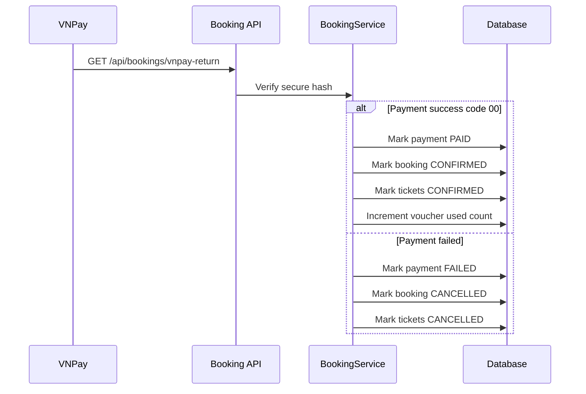
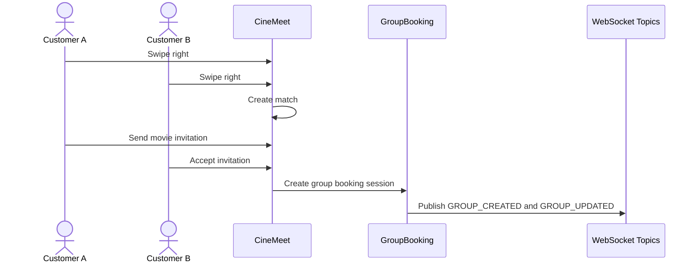
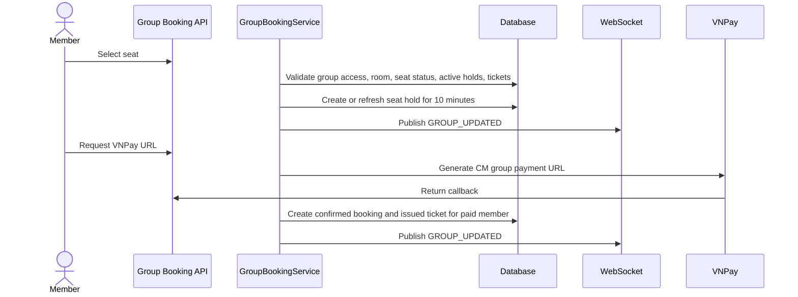
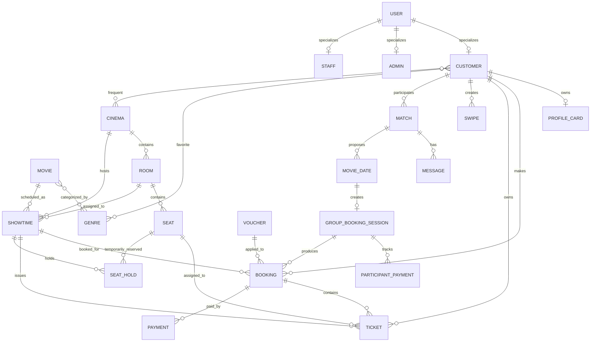

# Cinema Ticket Booking System - Backend

A Spring Boot backend for a cinema ticket booking platform. The project covers public movie discovery, cinema/showtime browsing, seat-based checkout, VNPay payment handling, customer accounts, admin management, and a CineMeet social booking module where matched customers can plan and pay for a movie together.

This repository is designed as a Java Spring Boot backend portfolio project. It demonstrates layered architecture, REST API design, JWT security, JPA entity modeling, payment callback handling, realtime WebSocket updates, and several design patterns used in practical business logic.

## Core Features

- Authentication with customer registration, login, BCrypt password hashing, and JWT access tokens.
- Public movie browsing with pagination, sorting, genre lookup, homepage data, and flexible movie search.
- Admin movie management with create, update, status update, and delete endpoints.
- Cinema, room, seat, and showtime management for administrators.
- Seat map retrieval with booked seat and held seat information.
- Booking checkout with seat conflict checks, voucher discount calculation, pending tickets, and VNPay payment URL generation.
- VNPay return handling that verifies payment signatures and updates payment, booking, ticket, and voucher usage state.
- Customer booking history and booking detail APIs.
- Voucher management with percentage, buy-N-get-free, and minimum-ticket discount rules.
- Admin dashboard overview and chart APIs with cache support for slower statistics.
- Employee and customer administration, including lock/unlock flows.
- CineMeet profile, discovery, swipe, match, chat, movie invitation, group booking, group seat selection, and per-participant payment flows.
- STOMP WebSocket support for realtime CineMeet match and group booking updates.
- Cloudinary-backed avatar upload support.

## Tech Stack

| Area | Technology |
| --- | --- |
| Language | Java 17 |
| Framework | Spring Boot 4.1.0 |
| Web | Spring Web MVC, REST controllers |
| Persistence | Spring Data JPA, Hibernate |
| Database | MySQL connector |
| Security | Spring Security, JWT, BCrypt |
| Realtime | Spring WebSocket, STOMP simple broker |
| Validation | Jakarta Validation |
| Caching | Spring Cache |
| Payment | VNPay integration |
| Media | Cloudinary |
| Boilerplate reduction | Lombok |
| Testing | JUnit 5, Mockito, Spring Boot Test |
| Build | Maven Wrapper, WAR packaging |

## Architecture



The code follows a typical Spring layered structure:

- `controller`: REST API entry points.
- `service`: business rules and transaction boundaries.
- `repository`: database access through Spring Data JPA.
- `entity`: domain model mapped to database tables.
- `dto`: request and response contracts.
- `config`: security, CORS, WebSocket, VNPay, Cloudinary, cache, and data initialization.
- `strategy`, `factory`, `decorator`: design-pattern implementations used by search, resource creation, and voucher calculation.
- `exception`: centralized API error handling.

## Key Workflows

### Standard Ticket Booking



### VNPay Payment Return



### CineMeet Match To Group Booking



### Group Seat And Payment



## Database Model



## API Overview

| Module | Base Path | Main Responsibility |
| --- | --- | --- |
| Auth | `/api/auth` | Register and login |
| Movies | `/api/movies` | Public movie browsing/search and admin movie management |
| Genres | `/api/genres` | Public genre list |
| Booking | `/api/bookings` | Cities, cinemas/showtimes, seats, checkout, VNPay return |
| Customer bookings | `/api/customer/bookings` | Customer booking history and booking detail |
| Customers | `/api/customers` | Current customer profile and avatar |
| Admin cinemas | `/api/admin/cinemas` | Cinema CRUD |
| Admin rooms | `/api/admin/rooms`, `/api/admin/cinemas/{cinemaId}/rooms` | Room CRUD and cinema-room lookup |
| Admin showtimes | `/api/admin/showtimes` | Showtime CRUD |
| Admin vouchers | `/api/admin/vouchers` | Voucher CRUD and lifecycle actions |
| Public vouchers | `/api/vouchers` | Applicable voucher lookup |
| Admin employees | `/api/admin/employees` | Employee CRUD, lock/unlock, password change |
| Admin customers | `/api/admin/customers` | Customer list, detail, block/unblock |
| Dashboard | `/api/admin/dashboard` | Overview and chart statistics |
| CineMeet | `/api/cinemeet` | Discovery, profile, swipes, matches, invitations, groups |
| CineMeet chat | `/api/cinemeet/matches/{matchId}/messages` | Match messages |
| CineMeet group booking | `/api/cinemeet/group-bookings` | Group lookup, seats, VNPay URL, payment status, cancellation |
| WebSocket | `/ws-cinemeet` | STOMP connection for match and group realtime events |

## Security

- Passwords are stored with BCrypt through `PasswordEncoder`.
- JWT tokens include email as the subject and role as a claim.
- `JwtAuthenticationFilter` reads Bearer tokens and sets Spring Security authorities as `ROLE_*`.
- Admin routes under `/api/admin/**` require `ROLE_ADMIN`.
- Customer and CineMeet routes require authenticated users where configured.
- CORS allows local development origins such as `localhost` and `127.0.0.1`.
- WebSocket clients must authenticate during STOMP `CONNECT`.
- WebSocket subscriptions are authorized against match/group ownership before access to `/topic/cinemeet/matches/{id}` or `/topic/cinemeet/groups/{id}` is allowed.

## Validation And Error Handling

- DTO validation is present for employee creation, update, and password changes.
- Business validation is handled in service methods with `ResponseStatusException`.
- Booking checkout checks showtime existence, seat existence, booked-seat conflicts, voucher validity, and payment state transitions.
- Group booking validates group membership, seat-room compatibility, seat availability, active holds, ticket conflicts, and group expiration.
- `GlobalExceptionHandler` normalizes API failures into `ApiErrorResponse` with a `message` field.
- Database and request parsing errors are converted to clearer client-facing messages.

## Design Patterns Used

- Strategy Pattern: movie search is split into multiple `MovieSearchStrategy` implementations, then combined by `SearchStrategyContext` into a JPA `Specification`.
- Factory Pattern: `CinemaFactory`, `RoomFactory`, and `ShowtimeFactory` centralize entity creation defaults.
- Decorator Pattern: vouchers are represented by `VoucherComponent` and wrapped by decorators such as percentage discount, buy-N-get-free, and minimum-ticket discounts.

These patterns are not decorative only; they support real extension points in movie search, resource creation, and discount calculation.

## Local Setup

### Prerequisites

- Java 17
- MySQL
- Maven Wrapper included in this repository

### Configuration

`src/main/resources/application.properties` is ignored by Git in this repository, so create it locally with values for your environment.

```properties
spring.application.name=backend

spring.datasource.url=jdbc:mysql://localhost:3306/movie_ticket_db?createDatabaseIfNotExist=true&useSSL=false&serverTimezone=Asia/Ho_Chi_Minh
spring.datasource.username=root
spring.datasource.password=your_password
spring.datasource.driver-class-name=com.mysql.cj.jdbc.Driver

spring.jpa.hibernate.ddl-auto=update
spring.jpa.show-sql=true
spring.jpa.properties.hibernate.format_sql=true

jwt.secret=replace_with_at_least_32_characters_secret_key
jwt.expiration=86400000

vnpay.tmnCode=your_vnpay_tmn_code
vnpay.hashSecret=your_vnpay_hash_secret
vnpay.url=https://sandbox.vnpayment.vn/paymentv2/vpcpay.html
vnpay.version=2.1.0
vnpay.command=pay
vnpay.returnUrl=http://localhost:8080/api/bookings/vnpay-return
vnpay.cinemeetReturnUrl=http://localhost:8080/api/cinemeet/group-bookings/vnpay-return

cloudinary.cloud-name=your_cloud_name
cloudinary.api-key=your_api_key
cloudinary.api-secret=your_api_secret
```

### Run

```bash
./mvnw spring-boot:run
```

On Windows PowerShell:

```powershell
.\mvnw.cmd spring-boot:run
```

### Test

```bash
./mvnw test
```

The current test suite includes Spring context loading and focused service tests for CineMeet profile behavior, CineMeet matching/likes, and group booking creation.

## Docker

No `Dockerfile` or `docker-compose.yml` is present in the current repository. The backend is intended to run locally through Maven with an external MySQL database.

## Project Structure

```text
src
|-- main
|   |-- java/org/example/backend
|   |   |-- config
|   |   |-- controller
|   |   |-- decorator
|   |   |-- dto
|   |   |-- entity
|   |   |-- enums
|   |   |-- exception
|   |   |-- factory
|   |   |-- repository
|   |   |-- security
|   |   |-- service
|   |   `-- strategy
|   `-- resources
|       |-- schema.sql
|       `-- dashboard-indexes.sql
`-- test
    `-- java/org/example/backend
```

## Technical Highlights

- Transactional booking and group-booking flows keep booking, ticket, payment, voucher, and seat-hold updates consistent.
- VNPay callbacks are verified with HMAC SHA-512 before state changes are applied.
- Group booking supports expiring sessions and 10-minute seat holds to reduce seat conflicts.
- JPA Specifications make movie search composable across many optional filters.
- Realtime CineMeet events are published only to authorized match and group topics.
- Admin dashboard statistics use Spring Cache to avoid recalculating slower aggregates.
- DTOs separate API contracts from JPA entities.

## Current Limitations

- The repository does not include a committed `application.properties` example file.
- Docker support is not included.
- API documentation is not generated with Swagger/OpenAPI in the current dependencies.
- Validation annotations are concentrated in selected admin DTOs; several public request DTOs rely mainly on service-level validation.
- Payment integration targets VNPay; other payment methods are represented in enums but are not implemented as gateway integrations in the current code.
- Seat conflict handling checks existing tickets and active holds, but there is no explicit database-level unique constraint shown in the committed schema for one ticket per seat per showtime.

## Future Improvements

- Add `application-example.properties` with safe placeholder values.
- Add Docker Compose for backend and MySQL.
- Add OpenAPI documentation for all REST endpoints.
- Expand request DTO validation across booking, CineMeet, voucher, movie, room, and showtime APIs.
- Add integration tests for checkout, VNPay return handling, and security rules.
- Add cleanup jobs for expired bookings and stale seat holds.
- Add database constraints or indexes for seat/showtime ticket uniqueness and high-traffic lookup paths.

## What This Project Demonstrates

- Building a non-trivial Spring Boot REST backend with real business workflows.
- Modeling cinema booking, payments, users, vouchers, and social matching with JPA relationships.
- Applying design patterns in places where they improve extensibility.
- Handling authentication, authorization, error responses, transactions, and realtime updates.
- Writing service-level tests around behavior that matters to the product.

## License

This project is provided for educational and portfolio purposes.

